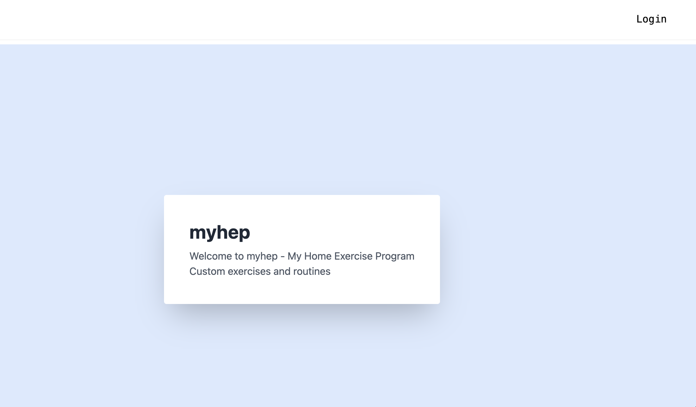

# My-HEP

## Project Description

Myhep, short for "my home exercise program", is web application that allows users to create a profile and work with a physical therapist to make a personal exercise program. The site is designed to connect physical therapists with their patients to streamline home workouts and fitness. Users have the ability to create a profile. Administrators on the web application (physical therapists) are able to assign exercises, create new patients, create new exercises, and assign exercises. Patients are able to view the established exercises and complete them. They can also save their exercises created by the administrators. The goal of the application is to make home exercise fun and accessible. 

## Built With 

- React
- MERN
- MongoDB
- Express
- Node
- Vite
- Tailwind

## Installation instructions

Execute the following commands to install dependencies, seed the database, and run the application.

```
npm run install

npm run seed

npm run dev
```

## Contributors

- James Carter (https://github.com/carterjamesmike | carterjamesmike@gmail.com)
- Seth Daulton (https://github.com/sethdaulton | seth.daulton@gmail.com)
- Connor Getchell (https://github.com/ConnorG24 | connman2400@gmail.com)
- Skipper Lizbeth Thurman (https://github.com/lizbeth-thurm | slthurman01@gmail.com)

## Screenshot



## Link to deployed application

https://protected-woodland-70982.herokuapp.com/

## Link to GitHub repository

https://github.com/carterjamesmike/My-HEP


